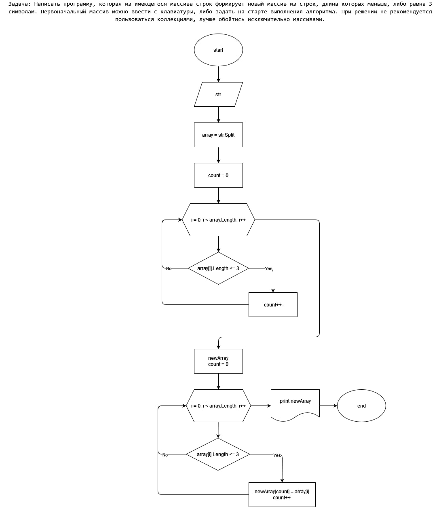

# FinalCourse
## Task
Задача: Написать программу, которая из имеющегося массива строк формирует
новый массив из строк, длина которых меньше, либо равна 3 символам.
Первоначальный массив можно ввести с клавиатуры
## Steps
- Ввод слов с клавиатуры
- Преобразования строки в массив
- Создания нового массива из менее, чем трёх символов
- Вывод массива на экран
- ✨Magic ✨
## Block diagram

